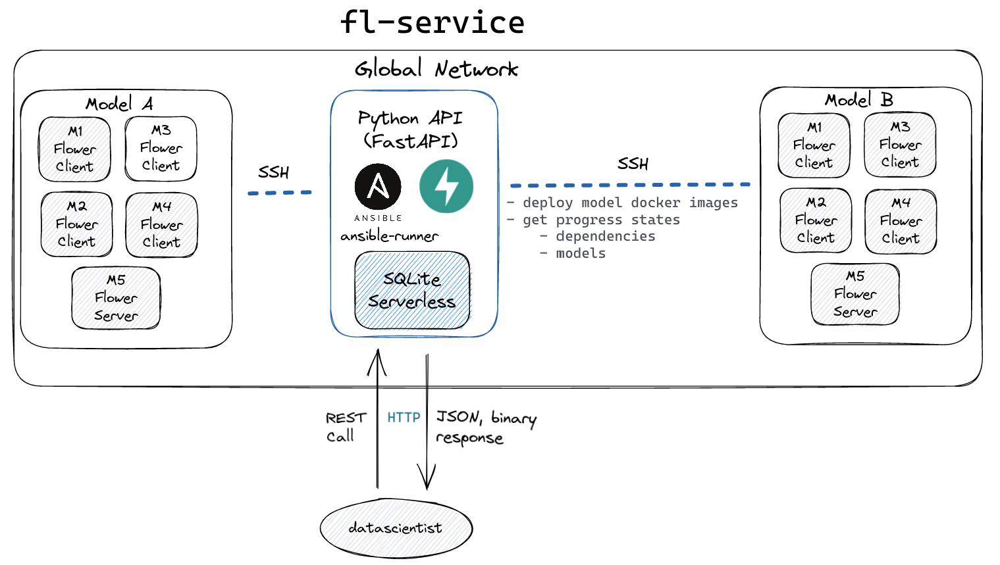

# fl-service

API which tailored to the needs of data scientists. The interface streamlines communication with remote hosts through the use of service endpoints, allowing for seamless API-based interactions. These endpoints empower users to initiate, terminate, and manage flower federated learning clusters, ensuring the preservation of a unified strategy across the system's architecture.

See: Command line client from **[here](https://github.com/nevzatseferoglu/flsvc)**.

## Docker installation, image generation and deployment

## Upload source file to turn into docker image

- Request template;

`curl -X POST "http://localhost:8000/docker/upload-source-files/ip_address/pytorch/" \
-H "Content-Type: multipart/form-data" \
-F file=@absolute_path_to_souce_zip_file`

- Example;

`curl -X POST "http://localhost:8000/docker/upload-source-files/192.168.1.105/pytorch/" \
-H "Content-Type: multipart/form-data" \
-F file=@/Users/nevzatseferoglu/Desktop/graduation-project-2/fl-service/171044024.zip`

## Starting deployment

- Request template;

`curl -X POST "http://localhost:8000/docker/deploy/ip_address/"`

- Example;

`curl -X POST "http://localhost:8000/docker/deploy/192.168.1.105/"`

### Makefile commands

- `make run`
    Run the server on port `:8000`. It can be changed through makefile.

- `make kill`
    Kill the running server process.

- `make lint`
    Apply code formatting, importing sorting and linting.

## Research

- [ ] Determine whether file locking is required.

## Success Criteria

- Manuel installation versus, saas installation time improvement will be %70. **(satisfied)**
- At least 4 client + 1 server. **(satisfied)**
- Face detection algorithm will run at 80% accuracy and new data will improve to 85% percent.

## ToDo

- [x] Change the database in a way that it can manage more than one fl algorithm. That means there will be more than one (server/clients) configuration.
- [x] Update architecture diagram
- [ ] The docstring for a function or method should summarize its behavior and document its arguments, return value(s), side effects, exceptions raised, and restrictions on when it can be called (all if applicable).
- [ ] Add diagrams (sequence)
- [ ] Set request path, query parameters validation.
- [ ] Introduce usa-case scenario and set up instructions of the host machine.
- [ ] Incrase observability.
- [ ] Add missing informations to the doc.
- [ ] Mention about contraints such as recorded host can participate a single federated learning.
- [ ] Target host machine might require key file to connect through paramiko. 

